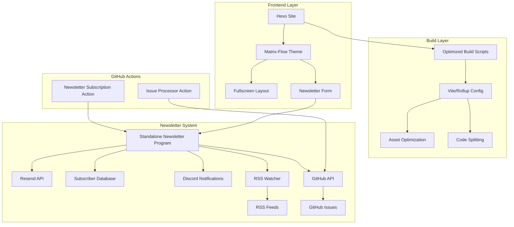
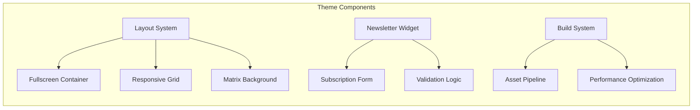
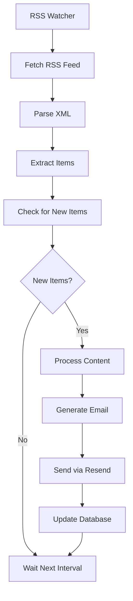
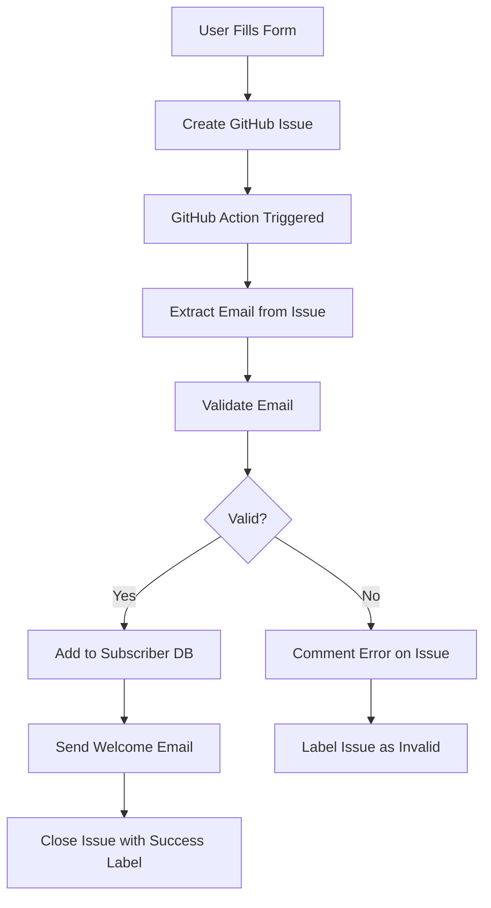

# Design Document

## Overview

Cette conception détaille l'amélioration du thème matrix-flow existant pour créer une expérience plein écran moderne avec des scripts de build optimisés et un système de newsletter portable utilisant Resend. L'architecture maintient la compatibilité avec Hexo tout en ajoutant des fonctionnalités avancées et des optimisations de performance.

## Architecture

### System Architecture



### Component Architecture



## Components and Interfaces

### 1. RSS Monitoring System

**Purpose**: Surveiller automatiquement les flux RSS et envoyer des emails lors de nouvelles entrées

**Key Components**:
- `RSSWatcher`: Service de surveillance des flux RSS avec polling configurable
- `ContentProcessor`: Processeur qui transforme le contenu RSS en format email
- `DuplicateDetector`: Détecteur de doublons basé sur GUID/URL
- `EmailTrigger`: Déclencheur automatique d'envoi d'emails

**Interface**:
```javascript
class RSSWatcher {
  async addFeed(url, settings) { }
  async checkFeeds() { }
  async processNewItems(items) { }
  startPolling(interval) { }
  stopPolling() { }
}

class ContentProcessor {
  async rssToEmail(rssItem, template) { }
  async generateSubject(rssItem, prefix) { }
  async sanitizeContent(content) { }
}
```

**RSS Polling Flow**:


### 2. GitHub Actions Integration System

**Purpose**: Utiliser GitHub Issues comme système d'inscription à la newsletter avec traitement automatique

**Key Components**:
- `IssueProcessor`: GitHub Action qui traite les nouvelles issues d'inscription
- `SubscriptionValidator`: Validation des données dans les issues
- `IssueLabeler`: Système de labels pour catégoriser les inscriptions
- `AutoResponder`: Réponses automatiques aux issues d'inscription

**GitHub Action Workflow**:
```yaml
name: Newsletter Subscription
on:
  issues:
    types: [opened, labeled]

jobs:
  process-subscription:
    if: contains(github.event.issue.labels.*.name, 'newsletter-subscription')
    runs-on: ubuntu-latest
    steps:
      - name: Extract Email
      - name: Validate Subscription
      - name: Add to Database
      - name: Send Welcome Email
      - name: Close Issue
```

**Issue Template Structure**:
```markdown
---
name: Newsletter Subscription
about: Subscribe to newsletter
title: 'Newsletter Subscription: [EMAIL]'
labels: newsletter-subscription
---

**Email:** your-email@example.com
**Preferences:** weekly/monthly
**Topics:** development, portfolio, updates
```

**Integration Flow**:


### 3. Fullscreen Layout System

**Purpose**: Transformer le thème existant pour utiliser tout l'espace d'écran disponible

**Key Components**:
- `FullscreenContainer`: Conteneur principal utilisant 100vh/100vw
- `ResponsiveGrid`: Système de grille adaptatif pour différentes tailles d'écran
- `ViewportManager`: Gestionnaire des dimensions d'écran et orientations

**Interface**:
```css
.fullscreen-container {
  width: 100vw;
  height: 100vh;
  overflow: hidden;
}

.responsive-grid {
  display: grid;
  grid-template-areas: 
    "header header"
    "main sidebar"
    "footer footer";
  grid-template-rows: auto 1fr auto;
}
```

### 2. Optimized Build System

**Purpose**: Améliorer les performances de build et la qualité du code généré

**Key Components**:
- `BuildOptimizer`: Orchestrateur principal des optimisations
- `AssetPipeline`: Pipeline de traitement des assets (CSS, JS, images)
- `CacheManager`: Gestionnaire de cache intelligent
- `BundleAnalyzer`: Analyseur de bundles pour optimisation

**Configuration Structure**:
```javascript
// Enhanced vite.config.js
export default defineConfig({
  plugins: [
    vue(),
    fullscreenOptimizer(),
    assetOptimizer(),
    performanceAnalyzer()
  ],
  build: {
    rollupOptions: {
      output: {
        manualChunks: {
          vendor: ['vue', 'vue-router'],
          theme: ['./src/theme/'],
          newsletter: ['./src/newsletter/']
        }
      }
    }
  }
})
```

### 3. Newsletter System Architecture

**Purpose**: Système de newsletter portable et réutilisable avec surveillance RSS et intégration Resend

**Key Components**:

#### 3.1 Frontend Newsletter Widget
- `NewsletterForm`: Composant de formulaire d'inscription qui crée une GitHub Issue
- `GitHubIssueCreator`: Service pour créer des issues d'inscription
- `SubscriptionValidator`: Validateur d'email côté client
- `FeedbackManager`: Gestionnaire des messages de confirmation/erreur

#### 3.2 GitHub Action Integration
- `IssueProcessor`: GitHub Action qui traite les issues d'inscription
- `SubscriberSync`: Synchronisation entre GitHub Issues et base de données
- `IssueValidator`: Validation des données d'inscription dans les issues

#### 3.3 Standalone Newsletter Program
- `NewsletterCLI`: Interface en ligne de commande
- `SubscriberManager`: Gestionnaire de base de données des abonnés
- `RSSWatcher`: Surveillant de flux RSS pour détecter nouvelles entrées
- `EmailComposer`: Compositeur d'emails avec templates basés sur RSS
- `ResendIntegration`: Interface avec l'API Resend
- `DiscordNotifier`: Notifications Discord pour les événements
- `ContentProcessor`: Processeur de contenu RSS vers format email
- `GitHubIntegration`: Interface avec l'API GitHub pour récupérer les issues

**Program Structure**:
```
newsletter-program/
├── src/
│   ├── cli/
│   │   ├── commands/
│   │   └── index.js
│   ├── core/
│   │   ├── subscriber-manager.js
│   │   ├── rss-watcher.js
│   │   ├── content-processor.js
│   │   ├── email-composer.js
│   │   ├── resend-client.js
│   │   └── github-integration.js
│   ├── templates/
│   │   ├── welcome.html
│   │   ├── newsletter.html
│   │   └── rss-notification.html
│   └── config/
│       └── default.json
├── .github/
│   └── workflows/
│       ├── newsletter-subscription.yml
│       └── issue-processor.yml
├── data/
│   ├── subscribers.db
│   ├── rss-cache.db
│   └── sent-items.db
└── package.json
```

## Data Models

### 1. Subscriber Model
```javascript
{
  id: String,
  email: String,
  subscribedAt: Date,
  status: 'active' | 'unsubscribed' | 'bounced',
  source: String, // 'website', 'import', etc.
  preferences: {
    frequency: 'weekly' | 'monthly',
    topics: Array<String>
  }
}
```

### 2. Newsletter Model
```javascript
{
  id: String,
  subject: String,
  content: String,
  htmlContent: String,
  scheduledAt: Date,
  sentAt: Date,
  status: 'draft' | 'scheduled' | 'sent' | 'failed',
  recipients: Array<String>,
  source: 'manual' | 'rss' | 'scheduled',
  rssItemId: String, // Si généré depuis RSS
  analytics: {
    sent: Number,
    delivered: Number,
    opened: Number,
    clicked: Number
  }
}
```

### 3. RSS Feed Model
```javascript
{
  id: String,
  url: String,
  title: String,
  lastChecked: Date,
  lastItemDate: Date,
  isActive: Boolean,
  checkInterval: Number, // en minutes
  template: String, // template email à utiliser
  settings: {
    autoSend: Boolean,
    subjectPrefix: String,
    includeFullContent: Boolean
  }
}
```

### 4. RSS Item Model
```javascript
{
  id: String,
  feedId: String,
  title: String,
  description: String,
  content: String,
  link: String,
  pubDate: Date,
  guid: String,
  processed: Boolean,
  emailSent: Boolean,
  sentAt: Date
}
```

### 5. GitHub Issue Subscription Model
```javascript
{
  issueNumber: Number,
  email: String,
  status: 'pending' | 'processed' | 'invalid' | 'duplicate',
  createdAt: Date,
  processedAt: Date,
  preferences: {
    frequency: String,
    topics: Array<String>
  },
  validationErrors: Array<String>
}
```

### 3. Theme Configuration Model
```javascript
{
  fullscreen: {
    enabled: Boolean,
    breakpoints: Object,
    animations: Object
  },
  newsletter: {
    enabled: Boolean,
    formPosition: 'header' | 'footer' | 'sidebar',
    styling: Object
  },
  performance: {
    lazyLoading: Boolean,
    codesplitting: Boolean,
    serviceWorker: Boolean
  }
}
```

## Error Handling

### 1. Build System Error Handling
- **Build Failures**: Rollback automatique vers la dernière version stable
- **Asset Optimization Errors**: Fallback vers assets non-optimisés
- **Cache Corruption**: Invalidation automatique et reconstruction

### 2. Newsletter System Error Handling
- **Resend API Failures**: Système de retry avec backoff exponentiel
- **Email Validation Errors**: Messages d'erreur clairs pour l'utilisateur
- **Database Errors**: Sauvegarde automatique et récupération

### 3. Frontend Error Handling
- **Layout Rendering Issues**: Fallback vers layout standard
- **JavaScript Errors**: Graceful degradation des fonctionnalités
- **Network Failures**: Mode offline avec service worker

## Testing Strategy

### 1. Unit Testing
- **Theme Components**: Tests des composants Vue/EJS individuels
- **Newsletter Logic**: Tests des fonctions de validation et d'envoi
- **Build Scripts**: Tests des transformations et optimisations

### 2. Integration Testing
- **Newsletter Flow**: Test complet inscription → envoi → réception
- **Build Pipeline**: Test de la chaîne complète de build
- **Theme Responsiveness**: Tests sur différentes tailles d'écran

### 3. Performance Testing
- **Lighthouse Audits**: Scores de performance automatisés
- **Load Testing**: Tests de charge sur le système de newsletter
- **Bundle Analysis**: Analyse de la taille des bundles générés

### 4. E2E Testing
- **User Subscription Flow**: Test complet du parcours utilisateur
- **Admin Newsletter Management**: Test des fonctionnalités d'administration
- **Cross-browser Compatibility**: Tests sur différents navigateurs

## Implementation Phases

### Phase 1: Fullscreen Layout Enhancement
1. Modification du layout principal pour support plein écran
2. Implémentation du système de grille responsive
3. Optimisation des animations et transitions

### Phase 2: Build System Optimization
1. Configuration avancée de Vite/Rollup
2. Implémentation du code splitting
3. Optimisation des assets et cache

### Phase 3: Newsletter System Development
1. Développement du programme standalone avec surveillance RSS
2. Intégration avec Resend API
3. Système de surveillance automatique des flux RSS
4. Interface d'administration et CLI

### Phase 4: Integration and Testing
1. Intégration du widget newsletter dans le thème
2. Tests complets et optimisations
3. Documentation et déploiement